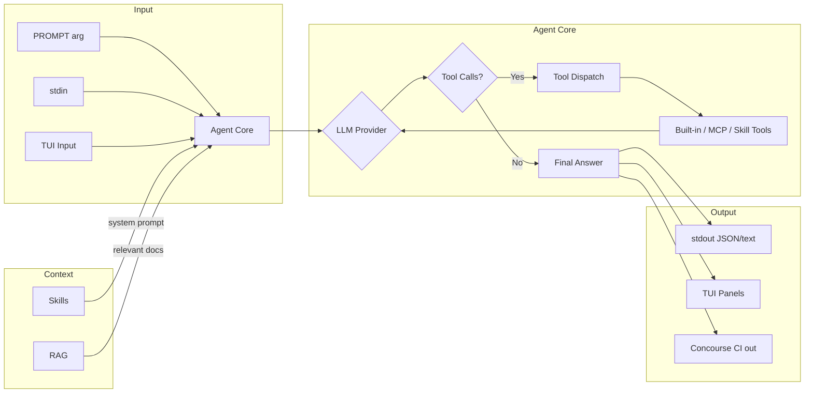
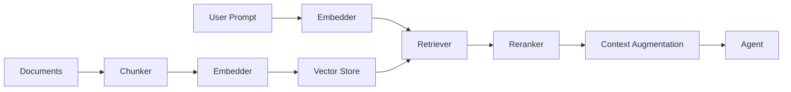

# Alchemy — CI/CD AI Agent

A cross-platform AI agent designed for CI/CD pipelines and interactive terminal use. Single binary, dual-mode operation: pipe mode for automation, TUI mode for interactive sessions.

## Philosophy

CI/CD environments are already isolated (containers, VMs, ephemeral runners). Adding another sandbox layer is redundant overhead. Alchemy trusts its environment and focuses on being a fast, reliable tool executor that an LLM can drive to accomplish tasks — whether in an automated pipeline or an interactive terminal session.

## Non-Goals

- **No sandbox** — No cgroups, no seccomp, no Landlock, no network isolation. The CI runner *is* the sandbox.
- **No platform-specific code in core logic** — Shell invocation (`sh -c` vs `cmd /C`) and terminal handling are the only exceptions. No `libc`, no Linux kernel features. Core agent logic has no `#[cfg(target_os)]`.
- **No confirm/interactive policy in pipe mode** — All tools auto-execute in pipe mode. TUI mode also auto-executes but displays progress visually. The CI pipeline author controls what the agent can do via prompt and environment.

## Goals

- **Single static binary** — `cargo build --release` produces one file. Drop it into any CI image.
- **Dual-mode operation** — Pipe mode for CI/CD automation; TUI mode (`alchemy tui`) for interactive local use. Same agent core, different I/O frontends.
- **Cross-platform** — Linux (x86_64, aarch64), macOS (x86_64, aarch64), Windows (x86_64). Same codebase, no `#[cfg(target_os)]` in core logic (shell invocation and terminal handling excepted).
- **Fast startup** — Under 50ms to first LLM call in pipe mode (with no MCP servers configured). No config file discovery, no setup wizard.
- **Deterministic output** — JSON output mode by default in pipe mode. Structured, machine-parseable results for downstream pipeline steps.
- **Environment-driven configuration** — All config via environment variables. Optional config files for TUI/skills/MCP. CI/CD pipelines set env vars natively.
- **Exit code semantics** — Exit 0 on success, non-zero on failure. CI pipelines depend on this.
- **Extensible tools** — Built-in tools augmented by MCP servers and skill-defined scripts.
- **Context-aware** — RAG pipeline for document-grounded responses when enabled.
- **Concourse CI native** — Usable as a standard Concourse CI resource type via `check`/`in`/`out` lifecycle.

## Architecture

```
src/
├── main.rs          — Entry point, subcommand dispatch (pipe / tui / rag)
├── agent.rs         — Agent loop (LLM call → tool dispatch → repeat)
├── providers/
│   ├── mod.rs       — Provider trait + factory (select by name)
│   ├── openai.rs    — OpenAI-compatible (also used by OpenRouter, Ollama)
│   ├── copilot.rs   — GitHub Copilot (PAT → session token refresh)
│   ├── gemini.rs    — Google Gemini (native API, message format conversion)
│   └── anthropic.rs — Anthropic (native Messages API, format conversion)
├── tools/
│   ├── mod.rs       — Tool registry + dispatch (built-in + MCP + skill tools)
│   ├── builtin.rs   — 5 built-in tools (read_file, write_file, list_dir, execute_cmd, fetch_url)
│   ├── mcp.rs       — MCP client: discover + invoke external MCP server tools
│   └── skill.rs     — Skill-defined tool execution
├── skills/
│   ├── mod.rs       — Skill loader, registry, trigger matching
│   └── types.rs     — Skill definition types (prompt, tools, triggers)
├── rag/
│   ├── mod.rs       — RAG pipeline orchestrator
│   ├── chunker.rs   — Document chunking strategies
│   ├── embedder.rs  — Embedding provider (local model or API)
│   ├── store.rs     — Vector store (SQLite + vec extension, pluggable backend)
│   └── retriever.rs — Retrieval + reranking
├── tui/
│   ├── mod.rs       — TUI app state + event loop
│   ├── layout.rs    — Panel layout (conversation, tools, files, status)
│   ├── widgets.rs   — Custom widgets (animated spinners, syntax highlighting)
│   ├── input.rs     — Input handling (key bindings, command parsing)
│   └── history.rs   — Session history persistence
├── concourse/
│   ├── mod.rs       — Concourse CI resource type entrypoint
│   ├── check.rs     — check: detect new versions
│   ├── in_cmd.rs    — in: fetch and prepare agent environment
│   └── out.rs       — out: execute agent and push results
├── types.rs         — Shared types (messages, tool calls, requests, responses)
└── output.rs        — Output formatting (JSON, plain text)
```

### Data Flow



**Agent Core is frontend-agnostic** — it receives messages and emits events. Pipe mode, TUI, and Concourse CI are adapters over the same core.

## Configuration

All configuration via environment variables. All `ALCHEMY_*` env vars apply uniformly to pipe mode, TUI mode, and Concourse CI mode. Optional config files for MCP and skills (primarily for TUI mode; pipe mode uses env vars exclusively). CLI flags take precedence over env vars when both are provided.

| Variable | Required | Default | Description |
|----------|----------|---------|-------------|
| `ALCHEMY_API_KEY` | Conditional | — | LLM provider API key. Required for remote providers (`openai`, `github-copilot`, `gemini`, `openrouter`, `anthropic`); optional for `ollama` |
| `ALCHEMY_MODEL` | No | provider-specific | Model name |
| `ALCHEMY_PROVIDER` | Yes | — | Provider: `openai`, `github-copilot`, `gemini`, `openrouter`, `anthropic`, `ollama` |
| `ALCHEMY_BASE_URL` | No | per-provider | Custom API endpoint |
| `ALCHEMY_MAX_STEPS` | No | `30` | Maximum agent loop iterations |
| `ALCHEMY_TIMEOUT_SECS` | No | `30` | Per-tool execution timeout (applies to `execute_cmd` and `fetch_url`) |
| `ALCHEMY_SYSTEM_PROMPT` | No | built-in | Custom system prompt (see [Built-in System Prompt](#built-in-system-prompt)) |
| `ALCHEMY_OUTPUT` | No | `json` | Output format: `json`, `text` |
| `ALCHEMY_LOG_LEVEL` | No | `warn` | Log level: `error`, `warn`, `info`, `debug`, `trace` |
| `ALCHEMY_CONTEXT_WINDOW` | No | `128000` | Model context window in tokens (conservative universal default; override for models with larger windows) |
| `ALCHEMY_MCP_SERVERS` | No | — | MCP server configuration (JSON string; for simple setups — use `ALCHEMY_MCP_CONFIG` file for complex configurations; see [MCP Client](#mcp-client)) |
| `ALCHEMY_MCP_CONFIG` | No | `~/.alchemy/mcp.json` | Path to MCP config file |
| `ALCHEMY_SKILLS_DIR` | No | `~/.alchemy/skills` | Skills directory path |
| `ALCHEMY_SKILLS_ENABLED` | No | `true` | Enable/disable skills system |
| `ALCHEMY_RAG_ENABLED` | No | `false` | Enable RAG pipeline |
| `ALCHEMY_RAG_STORE` | No | `sqlite` | Vector store backend: `sqlite`, `qdrant`, `chroma` |
| `ALCHEMY_RAG_STORE_PATH` | No | `~/.alchemy/rag/vectors.db` | SQLite vector DB path |
| `ALCHEMY_RAG_STORE_URL` | No | — | External vector DB URL (qdrant/chroma) |
| `ALCHEMY_RAG_EMBED_PROVIDER` | No | same as `ALCHEMY_PROVIDER` | Embedding provider |
| `ALCHEMY_RAG_EMBED_MODEL` | No | provider-specific | Embedding model |
| `ALCHEMY_RAG_CHUNK_SIZE` | No | `512` | Chunk size in tokens |
| `ALCHEMY_RAG_CHUNK_OVERLAP` | No | `64` | Chunk overlap in tokens |
| `ALCHEMY_RAG_TOP_K` | No | `5` | Number of chunks returned per retrieval |
| `ALCHEMY_SESSION_DIR` | No | `~/.alchemy/sessions` | TUI session storage path |

### Built-in System Prompt

When `ALCHEMY_SYSTEM_PROMPT` is not set, Alchemy uses this default:

```
You are Alchemy, a CI/CD AI agent. Use the provided tools to accomplish tasks.
Be concise. Report results as structured data when possible. If a tool fails,
analyze the error and either retry with a corrected approach or report the
failure with your analysis.
```

### Provider Defaults

Default models per provider:

| Provider | Default model |
|----------|---------------|
| `openai` | `gpt-4o-mini` |
| `github-copilot` | `gpt-5-mini` |
| `gemini` | `gemini-2.0-flash` |
| `openrouter` | `gpt-4o-mini` |
| `anthropic` | `claude-3-5-haiku-latest` |
| `ollama` | `llama3.2` |

No auto-detection. `ALCHEMY_PROVIDER` must always be set explicitly.

## CLI Interface

```bash
# Pipe mode (default)
echo "Run the test suite and report failures" | alchemy
alchemy "What files are in the current directory?"
git diff HEAD~1 | alchemy --output text "Summarize these changes as release notes" > notes.md

# TUI mode
alchemy tui
alchemy tui --session my-project

# RAG management
alchemy rag index src/
alchemy rag search "authentication flow"
alchemy rag status
alchemy rag clear
```

### Subcommands

```
alchemy [OPTIONS] [PROMPT]                 # Pipe mode (default)
alchemy tui [OPTIONS]                      # TUI mode
alchemy rag index <PATH> [--glob PATTERN]  # Index files for RAG
alchemy rag search <QUERY>                 # Test RAG retrieval
alchemy rag status                         # Show index status
alchemy rag clear                          # Clear RAG index
```

### Pipe Mode Arguments

```
alchemy [OPTIONS] [PROMPT]

Arguments:
  [PROMPT]    Instruction text (if omitted, reads from stdin)

Options:
  --output <FORMAT>    Output format: json, text [default: json]
  --system <PROMPT>    System prompt (overrides ALCHEMY_SYSTEM_PROMPT)
  --max-steps <N>      Max agent loop steps [default: 30]
  --timeout <SECS>     Per-tool timeout [default: 30]
  --version            Print version
  --help               Print help
```

### TUI Mode Arguments

```
alchemy tui [OPTIONS]

Options:
  --session <NAME>         Resume or create a named session [default: "default"]
  --session-dir <PATH>     Custom session storage path
  --system <PROMPT>        System prompt (overrides ALCHEMY_SYSTEM_PROMPT)
  --max-steps <N>          Max agent loop steps per turn [default: 30]
  --timeout <SECS>         Per-tool timeout [default: 30]
```

### Prompt + stdin Behavior (Pipe Mode)

- If only `[PROMPT]` is provided, it becomes the user message.
- If only stdin is provided, stdin becomes the user message.
- If both are provided, `[PROMPT]` is the instruction and stdin is appended as an input block in the same user message:

```text
<PROMPT>

--- stdin ---
<STDIN CONTENT>
```

- If neither `[PROMPT]` nor stdin is provided (and no subcommand is given), print usage help and exit 2.

### Output Format (Pipe Mode)

**JSON mode** (default):

```json
{
  "success": true,
  "answer": "All 42 tests passed.",
  "steps": 3,
  "tools_used": ["execute_cmd", "read_file"],
  "error": null
}
```

`success` means the agent run completed and emitted a final answer. Individual tool failures (for example, a command exiting non-zero) are reported in tool results and the final answer; they only set `success` to `false` if the agent cannot complete the run.

**Text mode**:

```
All 42 tests passed.
```

### Exit Codes

| Code | Meaning |
|------|---------|
| 0 | Success — agent produced a final answer |
| 1 | Agent/runtime failure — provider failure after retries, invalid provider response, max steps exceeded, or unrecoverable internal/tool runtime failure before a final answer |
| 2 | Configuration error — missing `ALCHEMY_PROVIDER`, missing required API key, invalid provider name, invalid env var, invalid CLI value, or no prompt/stdin provided |

## Built-in Tools

Five built-in tools, implemented directly without sandbox wrappers:

### `read_file`

Read a UTF-8 text file's contents. Truncates at 32KB.

```json
{"path": "string (required)"}
```

Result:

```json
{"content": "string", "truncated": false}
```

Implementation: `tokio::fs::read_to_string`, truncate at 32KB, set `truncated: true` when clipped.

### `write_file`

Write content to a file. Creates parent directories. Overwrites existing files (truncate + write).

```json
{"path": "string (required)", "content": "string (required)"}
```

Result:

```json
{"ok": true, "bytes_written": 123}
```

Implementation: `tokio::fs::create_dir_all` + `tokio::fs::write`. If the file already exists, it is overwritten.

### `list_dir`

List directory contents.

```json
{"path": "string (required)"}
```

Result:

```json
{"entries": ["file.txt", "subdir/"]}
```

Implementation: `tokio::fs::read_dir`, collect entries, sort, return JSON array of names (directories suffixed with `/`).

### `execute_cmd`

Execute a shell command.

```json
{"cmd": "string (required)", "cwd": "string (optional)", "timeout_secs": "integer (optional)"}
```

Result:

```json
{"stdout": "string", "stderr": "string", "exit_code": 0, "timed_out": false}
```

Implementation:
- **Unix (Linux/macOS)**: `tokio::process::Command::new("sh").args(["-c", cmd])`
- **Windows**: `tokio::process::Command::new("cmd").args(["/C", cmd])`
- Shell invocation is the primary `#[cfg(target_os)]` in the codebase (terminal handling in the TUI is the other)
- Timeout via `tokio::time::timeout`, defaults to `ALCHEMY_TIMEOUT_SECS`
- Returns stdout + stderr, exit code
- Non-zero exits are returned in `exit_code`; they are not agent failures by themselves
- On timeout: kill process, return `timed_out: true`

### `fetch_url`

Fetch content from a URL.

```json
{"url": "string (required)"}
```

Result:

```json
{"url": "string", "content": "string", "content_type": "text/plain", "truncated": false}
```

Implementation: `reqwest::get(url)`, read body as text, truncate at 32KB, set `truncated: true` when clipped. Connect timeout: 10 seconds. Total timeout: `ALCHEMY_TIMEOUT_SECS` (default 30s).

### Tool Namespace

Tools from different sources are distinguished by prefix to avoid name collisions:

```
Built-in:  read_file, write_file, list_dir, execute_cmd, fetch_url
MCP:       mcp_<server>_<tool>
Skill:     skill_<skill>_<script>
```

## MCP Client

Alchemy acts as an MCP (Model Context Protocol) client, connecting to external MCP servers to discover and use their tools alongside built-in tools.

### Configuration

**Via environment variable** (pipe mode):

```bash
ALCHEMY_MCP_SERVERS='[{"name":"github","transport":"stdio","cmd":"npx @modelcontextprotocol/server-github"}]'
```

**Via config file** (TUI mode or persistent setup):

```json
// ~/.alchemy/mcp.json
{
  "servers": [
    {
      "name": "github",
      "transport": "stdio",
      "cmd": "npx @modelcontextprotocol/server-github",
      "env": { "GITHUB_TOKEN": "${GITHUB_TOKEN}" }
    },
    {
      "name": "database",
      "transport": "sse",
      "url": "http://localhost:3001/mcp"
    }
  ]
}
```

### Supported Transports

| Transport | Description |
|-----------|-------------|
| `stdio` | Launch subprocess, communicate via stdin/stdout (JSON-RPC) |
| `sse` | Connect to remote MCP server via HTTP Server-Sent Events |

### Behavior

1. On agent startup, connect to all configured MCP servers
2. Call `tools/list` to discover available tools on each server
3. Merge MCP tools with built-in tools; present all to the LLM with `mcp_<server>_` prefix
4. When the LLM calls an MCP tool, Alchemy forwards the invocation via the appropriate transport
5. MCP server connection failure: log warning, continue without that server's tools (graceful degradation)
6. MCP server crash mid-session: return error result to LLM, let it decide how to proceed

## Skills System

Alchemy supports the [Agent Skills Specification](https://agentskills.io/specification). Skills provide additional system prompt context and executable scripts that extend Alchemy's capabilities.

### Skill Structure

```
~/.alchemy/skills/
├── rust-reviewer/
│   ├── SKILL.md              # Required: YAML frontmatter + Markdown instructions
│   ├── scripts/              # Optional: executable scripts
│   │   ├── clippy-strict.sh
│   │   └── cargo-audit.sh
│   ├── references/           # Optional: detailed documentation
│   │   └── REFERENCE.md
│   └── assets/               # Optional: templates, resources
├── security-scanner/
│   ├── SKILL.md
│   └── scripts/
│       └── audit.py
```

### SKILL.md Format

Per the Agent Skills Specification, each skill has a `SKILL.md` with YAML frontmatter and Markdown body:

```markdown
---
name: rust-reviewer
description: "Expert Rust code reviewer. Use when working with Rust projects,
  Cargo.toml files, or when asked to review Rust code. Checks for unsafe blocks,
  unnecessary allocations, and idiomatic patterns."
license: MIT
compatibility: "Requires cargo and clippy installed"
metadata:
  author: "your-name"
  version: "1.0"
---

# Rust Code Reviewer

When reviewing Rust code:
- Check for unsafe blocks and justify each one
- Prefer zero-copy approaches
- Flag unnecessary allocations

## Tools

Run strict clippy analysis:
scripts/clippy-strict.sh

Run security audit:
scripts/cargo-audit.sh

See [detailed patterns](references/REFERENCE.md) for common issues.
```

### Progressive Disclosure

Skills are loaded progressively per the specification:

1. **Metadata** (~100 tokens): `name` and `description` fields loaded at startup for all skills
2. **Instructions** (< 5000 tokens recommended): Full `SKILL.md` body loaded when skill is activated
3. **Resources** (as needed): Files in `scripts/`, `references/`, `assets/` loaded only when required

### Trigger Strategy

The Agent Skills Specification does not prescribe trigger mechanisms; Alchemy implements its own:

1. Scan skill directory on startup, parse all `SKILL.md` frontmatter
2. Match `description` keywords against user prompt and cwd file patterns:
   - Keyword matching: words in `description` vs words in user prompt
   - File pattern inference: if `description` mentions "Rust" → check for `Cargo.toml` in cwd
3. Activated skills: load full `SKILL.md`, append to system prompt
4. Scripts referenced in activated skills: register as callable tools (executed via `execute_cmd`) with `skill_<name>_<script>` naming

## RAG Pipeline

Optional document-grounded context augmentation. Disabled by default (`ALCHEMY_RAG_ENABLED=false`).

### Architecture



### Chunking Strategies

| Source type | Strategy |
|-------------|----------|
| Plain text | Fixed-size chunks with overlap, split on sentence boundaries |
| Code | Function/class-level splitting (regex-based; tree-sitter optional) |
| Markdown | Heading-based splitting |

Chunk size and overlap are configurable via `ALCHEMY_RAG_CHUNK_SIZE` (default 512 tokens) and `ALCHEMY_RAG_CHUNK_OVERLAP` (default 64 tokens).

### Embedding Providers

| Provider | Default embedding model | Dimensions |
|----------|------------------------|------------|
| `openai` | `text-embedding-3-small` | 1536 |
| `gemini` | `text-embedding-004` | 768 |
| `ollama` | `nomic-embed-text` | 768 |
| `github-copilot` | `text-embedding-3-small` | 1536 |
| `openrouter` | provider/model-dependent | varies |

Uses the same provider infrastructure as LLM calls. Embedding provider defaults to `ALCHEMY_PROVIDER` but can be overridden with `ALCHEMY_RAG_EMBED_PROVIDER`. Only `openai`, `gemini`, `ollama`, `github-copilot`, and `openrouter` support embeddings; if RAG is enabled with a non-embedding provider (e.g., `anthropic`), `ALCHEMY_RAG_EMBED_PROVIDER` must be set explicitly or Alchemy exits with code 2.

### Vector Store

**SQLite (default):** Uses `sqlite-vec` extension, statically compiled and linked into the binary via build script (no external `.so`/`.dll` required at runtime). Zero external dependencies.

```sql
-- Dimension is configured at table creation based on ALCHEMY_RAG_EMBED_PROVIDER
CREATE VIRTUAL TABLE vec_chunks USING vec0(
  embedding float[768]  -- e.g., 768 for Gemini/Ollama, 1536 for OpenAI
);
CREATE TABLE chunks (
  id INTEGER PRIMARY KEY,
  source_path TEXT,
  content TEXT,
  chunk_index INTEGER,
  metadata TEXT  -- JSON
);
```

**External DB:** Connects to Qdrant or Chroma via HTTP API for large-scale document stores.

### CLI Subcommands

```bash
alchemy rag index <path>                # Index a file or directory
alchemy rag index --glob "src/**/*.rs"  # Index files matching glob pattern
alchemy rag search "query"              # Test retrieval (print matching chunks)
alchemy rag status                      # Show index statistics
alchemy rag clear                       # Clear all indexed data
```

### Agent Integration

RAG results are injected as additional context in the system prompt. The agent loop itself is unmodified:

```
System Prompt (built-in or custom)
+ Skills context (activated skill instructions)
+ RAG context: "Relevant documents:\n[chunk 1]\n[chunk 2]..."
+ User Message
```

## TUI Mode

Interactive terminal interface launched via `alchemy tui`. Uses `ratatui` + `crossterm` for cross-platform terminal rendering.

### Layout

```
╔══════════════════════════════════════════════════════════════════╗
║  Alchemy v0.1.0  │ gpt-4o-mini │ ⏱ 3 steps │ 📊 2.1k tokens  ║  ← Status Bar
╠══════════════════════════════╦═══════════════════════════════════╣
║                              ║  🔧 Tool Execution               ║
║  💬 Conversation             ║  ┌────────────────────────────┐  ║
║                              ║  │ ⣾ execute_cmd: cargo test  │  ║
║  You: Run the tests          ║  │   running... 3.2s          │  ║
║                              ║  │ ✓ read_file: src/main.rs   │  ║
║  Alchemy: Running tests...   ║  │   423 bytes, 0.01s         │  ║
║  I'll execute `cargo test`   ║  └────────────────────────────┘  ║
║  and analyze the results.    ║                                   ║
║                              ╠═══════════════════════════════════╣
║  ┃ $ cargo test              ║  📁 File Activity                 ║
║  ┃ running 42 tests          ║  ┌────────────────────────────┐  ║
║  ┃ test result: ok           ║  │ R src/main.rs              │  ║
║                              ║  │ W test_output.json         │  ║
║  All 42 tests passed. ✓     ║  │ R Cargo.toml               │  ║
║                              ║  └────────────────────────────┘  ║
╠══════════════════════════════╩═══════════════════════════════════╣
║  > Type your message...                                    ^S   ║  ← Input Bar
╚══════════════════════════════════════════════════════════════════╝
```

### Panels

| Panel | Content | Dynamic Effects |
|-------|---------|-----------------|
| **Status Bar** | Version, model name, step count, token usage, session name | Token count updates in real-time |
| **Conversation** | User/assistant messages, tool output summaries, markdown rendering | Typewriter effect (streaming tokens appear incrementally), syntax highlighting |
| **Tool Execution** | Active/completed tool calls, status, duration | Braille spinner (`⣾⣽⣻⢿⡿⣟⣯⣷`), color transition on completion (green ✓ / red ✗) |
| **File Activity** | Files read/written during the session, R/W markers | Fade-in animation on new entries |
| **Input Bar** | User text input, keyboard shortcut hints | Blinking cursor |

### Key Bindings

| Key | Action |
|-----|--------|
| `Enter` | Send message |
| `Shift+Enter` | Insert newline (multiline input) |
| `Ctrl+C` | Interrupt current agent run |
| `Ctrl+D` | Exit TUI |
| `Tab` | Cycle panel focus |
| `Ctrl+L` | Clear conversation and reset session |
| `Ctrl+S` | Manually save session |
| `↑/↓` | Navigate prompt history (in input); scroll focused panel (when input empty) |
| `Home/End` | Scroll focused panel to top/bottom (when input empty); move cursor (otherwise) |
| `PageUp/PageDown` | Scroll focused panel |
| `Alt+↑/↓`, `Ctrl+↑/↓` | Scroll focused panel |
| `Alt+T` | Toggle Tools panel |
| `Alt+F` | Toggle Files panel |
| `Alt+C` | Cycle colour theme |
| `Alt+S` | Show loaded Skills overlay |
| `Alt+M` | Show MCP servers overlay |
| `?` | Show key bindings help |

### Multi-Turn Conversation

TUI mode maintains a persistent conversation with full message history. The same context compaction rules apply when the context window limit is approached.

### Session Persistence

```
~/.alchemy/sessions/
├── default/
│   ├── session.json      # Metadata: model, created_at, updated_at
│   └── messages.jsonl    # Append-only, one JSON message per line
├── my-project/
│   ├── session.json
│   └── messages.jsonl
```

- Messages are auto-appended to `messages.jsonl` after each agent response completes
- JSONL format ensures crash-safety (append-only, no rewriting)
- Sessions are resumed with `alchemy tui --session <name>`
- All 5 built-in tools are available in TUI mode

## Concourse CI Resource Type

Alchemy is usable as a standard Concourse CI resource type following the `check`/`in`/`out` lifecycle. The primary pattern is **resource-driven**: the prompt is defined in the resource `source`, and `check_every` controls how often the agent runs.

### Resource Type Definition

```yaml
resource_types:
  - name: alchemy
    type: registry-image
    check_every: 24h
    source:
      repository: ghcr.io/canonical/alchemy
      tag: latest
```

### Resource Configuration

The prompt and LLM configuration live in `source`. Both `api_key` and `provider` are required.

```yaml
resources:
  - name: weather
    type: alchemy
    check_every: 1h
    source:
      api_key: ((ai-provider/github-copilot.api-key))
      provider: github-copilot
      model: gpt-5-mini
      prompt: "Fetch the weather for Madrid from wttr.in using curl."

  - name: food-recommendations
    type: alchemy
    check_every: 24h
    source:
      api_key: ((ai-provider/github-copilot.api-key))
      provider: github-copilot
      model: claude-opus-4.6
      prompt: "Find good restaurants in Madrid for a team dinner, EUR 50-100 per person."
```

#### Source Fields

| Field | Required | Description |
|-------|----------|-------------|
| `api_key` | Yes | LLM provider API key |
| `provider` | Yes | Provider name: `openai`, `github-copilot`, `gemini`, `openrouter`, `anthropic`, `ollama` |
| `model` | No | Model name (defaults per provider) |
| `prompt` | Conditional | The instruction for the agent to execute. Required for resource-driven usage (Pattern 1). For put-only usage (Pattern 2), can be omitted if `params.prompt` is always provided |
| `system_prompt` | No | Custom system prompt |
| `max_steps` | No | Maximum agent loop iterations (default: 30) |
| `timeout_secs` | No | Per-tool execution timeout (default: 30) |

### Lifecycle

**`check`** — Runs periodically per `check_every`. Executes the full agent loop with `source.prompt` (including tool calls), hashes the final response content, and emits a new version when the result differs from the previous run. This drives `trigger: true` on downstream `get` steps.

> **Note:** `check` executes the full agent with all tools enabled. The prompt author is responsible for ensuring `check`-triggered prompts are safe for repeated execution (e.g., read-only operations like fetching data). Prompts that write files or modify state will produce side effects on every `check` interval.

```json
[{"ref": "sha256:a1b2c3d4e5f6"}]
```

On first run (no previous version), always emits a version.

**`in`** (`get`) — Re-executes the agent with `source.prompt` and writes output files to the resource directory. Each `in` invocation runs the agent independently (no cross-container caching); the version `ref` serves only as a trigger signal, not as a cache key.

```
<resource>/
├── response.txt        # Agent's final answer (plain text)
├── response.json       # Structured output (JSON format)
└── metadata.json       # Run metadata (model, steps, tools_used, duration)
```

**`out`** (`put`) — For ad-hoc or event-driven agent execution at the job level. All `source` fields can be overridden or supplemented via `params`, giving full flexibility to customize each invocation. The `out` script runs the agent, outputs a version to stdout, and the implicit `get` (triggered by Concourse CI after every `put`) calls `in` to write the output files (`response.txt`, `response.json`, `metadata.json`) to the resource directory for subsequent steps.

```yaml
- put: ai-reviewer
  params:
    prompt: "Review this diff for bugs and security issues"
    stdin_file: diff.txt
    model: gpt-4o
    output_format: json
    max_steps: 20
```

#### Put Params

| Field | Required | Description |
|-------|----------|-------------|
| `prompt` | No | Override `source.prompt`. If `source.prompt` is also set, `params.prompt` takes precedence |
| `stdin_file` | No | Read additional input from this file (path relative to build directory). Appended to prompt as `--- stdin ---` block |
| `model` | No | Override `source.model` for this invocation |
| `system_prompt` | No | Override `source.system_prompt` for this invocation |
| `max_steps` | No | Override `source.max_steps` for this invocation |
| `timeout_secs` | No | Override `source.timeout_secs` for this invocation |
| `output_format` | No | Output format: `json`, `text` (default: both `response.txt` and `response.json` are written) |

### Usage Patterns

**Pattern 1: Periodic scheduled task** (primary) — Prompt in `source`, driven by `check_every`:

```yaml
resources:
  - name: weather
    type: alchemy
    check_every: 1h
    source:
      api_key: ((ai-provider/github-copilot.api-key))
      provider: github-copilot
      model: gpt-5-mini
      prompt: "Fetch the weather for Madrid from wttr.in using curl."

  - name: alchemy-image
    type: registry-image
    source:
      repository: ghcr.io/canonical/alchemy
      tag: latest

jobs:
  - name: check-weather
    public: true
    plan:
      - get: weather
        trigger: true
      - get: alchemy-image
      - task: display
        image: alchemy-image
        config:
          platform: linux
          inputs:
            - name: weather
          run:
            path: sh
            args:
              - -c
              - cat weather/response.txt
```

**Pattern 2: Event-driven with `put`** — Use `put` to run the agent with job-level parameters, combining resource config with per-invocation overrides:

```yaml
resources:
  - name: ai-reviewer
    type: alchemy
    source:
      api_key: ((ai-provider/github-copilot.api-key))
      provider: github-copilot
      model: gpt-4o-mini
      system_prompt: "You are a code review assistant. Be concise and actionable."

  - name: alchemy-image
    type: registry-image
    source:
      repository: ghcr.io/canonical/alchemy
      tag: latest

jobs:
  - name: review-on-push
    plan:
      - get: source-code
        trigger: true
      - get: alchemy-image
      - task: generate-diff
        image: alchemy-image
        config:
          platform: linux
          inputs:
            - name: source-code
          outputs:
            - name: diff
          run:
            path: sh
            args:
              - -c
              - |
                cd source-code
                git diff HEAD~1 > ../diff/changes.diff
      - put: ai-reviewer
        params:
          prompt: "Review this diff for bugs and security issues"
          stdin_file: diff/changes.diff
          model: gpt-4o
```

**Pattern 3: Task binary** — Use Alchemy directly in a task step (not as a resource type) for full control:

```yaml
resources:
  - name: alchemy-image
    type: registry-image
    source:
      repository: ghcr.io/canonical/alchemy
      tag: latest

jobs:
  - name: ai-review
    plan:
      - get: source-code
        trigger: true
      - get: alchemy-image
      - task: review
        image: alchemy-image
        config:
          platform: linux
          inputs:
            - name: source-code
          outputs:
            - name: review
          params:
            ALCHEMY_API_KEY: ((openai.api-key))
            ALCHEMY_PROVIDER: openai
            ALCHEMY_MODEL: gpt-4o-mini
          run:
            path: sh
            args:
              - -c
              - |
                cd source-code
                git diff HEAD~1 | alchemy --output text "Review this diff" > ../review/result.txt
```

### Container Image

```dockerfile
FROM ubuntu:latest
RUN apt-get update && apt-get install -y --no-install-recommends ca-certificates curl && rm -rf /var/lib/apt/lists/*
COPY alchemy /usr/local/bin/alchemy
COPY scripts/check /opt/resource/check
COPY scripts/in /opt/resource/in
COPY scripts/out /opt/resource/out
```

`check`, `in`, and `out` are thin shell wrappers that call the alchemy binary and handle Concourse CI's JSON stdin/stdout protocol. The image also serves as a task image with common CI tools pre-installed.

## LLM Provider Interface

### Provider Trait

```rust
#[async_trait]
pub trait Provider: Send + Sync {
    fn name(&self) -> &str;
    async fn chat(&self, request: LlmRequest) -> Result<LlmResponse>;
    async fn chat_streaming(&self, request: LlmRequest, tx: tokio::sync::mpsc::Sender<String>) -> Result<LlmResponse>;
}
```

`chat_streaming` sends tokens incrementally via `tx` as they arrive, then returns the final `LlmResponse` containing the fully assembled response text and metadata (token usage, finish reason). The `LlmResponse` from streaming is identical to the one from `chat`.

The agent loop always uses `chat_streaming` (to handle long responses without timeout and enable TUI typewriter rendering). The `chat` method is used for non-streaming contexts: RAG embedding requests and simple single-shot calls where streaming overhead is unnecessary.

### Supported Providers

1. **OpenAI-compatible** — Any `/v1/chat/completions` endpoint
2. **GitHub Copilot** — Auto-refreshes session token from PAT via `api.github.com/copilot_internal/v2/token`
3. **Google Gemini** — Native Gemini API with message format conversion
4. **Anthropic** — Native Messages API with format conversion
5. **OpenRouter** — OpenAI-compatible endpoint with OpenRouter-specific auth/base URL defaults
6. **Ollama** — Local OpenAI-compatible endpoint, typically without an API key

### Streaming

Streaming is used internally for the agent loop (to handle long responses without timeout). In pipe mode, tokens are not printed to stderr — only the final structured output goes to stdout. In TUI mode, streaming tokens are rendered in the Conversation panel with a typewriter effect.

## Agent Loop

```
1. Parse subcommand and arguments
2. If pipe mode: parse [PROMPT] and optional stdin; if neither, print usage and exit 2
3. Load activated skills (match triggers against prompt + cwd)
4. If RAG enabled: retrieve relevant chunks for user prompt
5. Build system prompt (built-in + skills context + RAG context) + user message
6. Loop:
   a. Call LLM with messages + tool definitions (built-in + MCP + skill tools)
   b. If response has no tool calls → final answer → output → exit 0
   c. For each tool call:
      - Dispatch to appropriate handler (built-in / MCP / skill)
      - Execute tool directly (no sandbox, no confirm)
      - Append tool result to messages
   d. Check step limit → if exceeded → output error → exit 1
   e. Check context window → if near limit → compact context
   f. Continue loop
```

### Token Counting

Token counts are estimated for context window management:

- **Primary method**: Use `usage.total_tokens` from provider response when available
- **Fallback**: Character-based estimation (`character_count / 4`) for providers that don't return usage data or for pre-request estimation
- These estimates drive context compaction decisions only; exact counts are not required

### Context Compaction

- Keep system prompt (including skills and RAG context)
- Keep last 6 **logical turns** (a turn = user message + assistant response including any tool_call/tool_result pairs within that response cycle)
- Drop older non-system messages without summarization
- Trigger at 85% of `ALCHEMY_CONTEXT_WINDOW`

### Parallel Tool Calls

When the LLM returns multiple tool calls in a single response, preserve response order by default. Execute only clearly independent calls concurrently via `futures::join_all`:

- `read_file`, `list_dir`, and `fetch_url` may be batched (unless targeting the same path)
- `write_file` and `execute_cmd` run sequentially
- MCP and skill tool calls run sequentially (external side effects are unpredictable)

## Error Handling

- **LLM API errors**: Retry with exponential backoff (3 attempts, 1s/2s/4s). On final failure, output error JSON and exit 1.
- **Tool execution errors**: Return structured error content to the LLM as tool output. Let the LLM decide whether to retry or report failure.
- **Command non-zero exits**: Return them as normal `execute_cmd` results with `exit_code != 0`.
- **Timeout**: Kill the tool process, return `timed_out: true` to the LLM. Exit 1 only if the agent cannot recover and produce a final answer.
- **Missing provider/API key**: Print error to stderr, exit 2. `ALCHEMY_PROVIDER` is always required; `ALCHEMY_API_KEY` is required for remote providers.
- **MCP server failure**: Log warning, exclude that server's tools, continue with remaining tools.
- **Skill loading failure**: Log warning, skip the broken skill, continue with other skills.
- **RAG failure**: Log warning, proceed without RAG context (graceful degradation).

## Dependencies

```toml
[dependencies]
# Core
tokio = { version = "1", features = ["rt-multi-thread", "time", "process", "io-util", "io-std", "net", "macros", "fs"] }
reqwest = { version = "0.12", default-features = false, features = ["json", "stream", "rustls-tls", "charset", "http2"] }
serde = { version = "1", features = ["derive"] }
serde_json = "1"
clap = { version = "4", features = ["derive", "env", "subcommand"] }
anyhow = "1"
tracing = "0.1"
tracing-subscriber = { version = "0.3", features = ["fmt", "env-filter"] }
futures = "0.3"
async-trait = "0.1"

# TUI
ratatui = "0.29"
crossterm = "0.28"
syntect = "5"

# RAG
sqlite-vec = "0.1"
rusqlite = { version = "0.32", features = ["bundled"] }

# MCP
jsonrpc-core = "18"
```

## Build & Release

```toml
[profile.release]
opt-level = "z"
lto = true
codegen-units = 1
panic = "abort"
strip = true
```

### CI Matrix

Build and test on:
- `ubuntu-latest` (`x86_64-unknown-linux-gnu`)
- `ubuntu-24.04-arm` (`aarch64-unknown-linux-gnu`)
- `macos-13` (`x86_64-apple-darwin`)
- `macos-14` (`aarch64-apple-darwin`)
- `windows-latest` (`x86_64-pc-windows-msvc`)

Release artifacts:
- Pre-built binaries for all 5 target triples via GitHub Actions
- Concourse CI resource type Docker image: `ghcr.io/canonical/alchemy:latest`

## Example CI Usage

### GitHub Actions

```yaml
- name: AI Code Review
  env:
    ALCHEMY_API_KEY: ${{ secrets.OPENAI_API_KEY }}
    ALCHEMY_PROVIDER: openai
    ALCHEMY_MODEL: gpt-4o-mini
  run: |
    git diff ${{ github.event.before }}..HEAD | \
      alchemy "Review this diff. Report bugs and style issues." > review.json
```

### GitLab CI

```yaml
ai-review:
  script:
    - git diff HEAD~1 | alchemy --output text "Summarize changes" > summary.txt
  variables:
    ALCHEMY_API_KEY: $OPENAI_KEY
    ALCHEMY_PROVIDER: openai
    ALCHEMY_MODEL: gpt-4o-mini
```

### Concourse CI

**Periodic task (resource-driven):**

```yaml
resource_types:
  - name: alchemy
    type: registry-image
    check_every: 24h
    source:
      repository: ghcr.io/canonical/alchemy
      tag: latest

resources:
  - name: weather
    type: alchemy
    check_every: 1h
    source:
      api_key: ((ai-provider/github-copilot.api-key))
      provider: github-copilot
      model: gpt-5-mini
      prompt: "Fetch the weather for Madrid from wttr.in using curl."

  - name: alchemy-image
    type: registry-image
    source:
      repository: ghcr.io/canonical/alchemy
      tag: latest

jobs:
  - name: check-weather
    public: true
    plan:
      - get: weather
        trigger: true
      - get: alchemy-image
      - task: display
        image: alchemy-image
        config:
          platform: linux
          inputs:
            - name: weather
          run:
            path: sh
            args:
              - -c
              - cat weather/response.txt
```

**Event-driven task (binary in task step):**

```yaml
resources:
  - name: alchemy-image
    type: registry-image
    source:
      repository: ghcr.io/canonical/alchemy
      tag: latest

jobs:
  - name: ai-review
    plan:
      - get: source-code
        trigger: true
      - get: alchemy-image
      - task: review
        image: alchemy-image
        config:
          platform: linux
          inputs:
            - name: source-code
          params:
            ALCHEMY_API_KEY: ((openai.api-key))
            ALCHEMY_PROVIDER: openai
            ALCHEMY_MODEL: gpt-4o-mini
          run:
            path: sh
            args:
              - -c
              - |
                cd source-code
                git diff HEAD~1 | alchemy --output text "Summarize changes" > summary.txt
                cat summary.txt
```

### Generic

```bash
# Ensure ALCHEMY_API_KEY, ALCHEMY_PROVIDER, and ALCHEMY_MODEL are set
export ALCHEMY_API_KEY="sk-..."
export ALCHEMY_PROVIDER="openai"
export ALCHEMY_MODEL="gpt-4o-mini"

# Run tests, let AI analyze failures
cargo test 2>&1 | alchemy --output text "Analyze test failures and suggest fixes"

# Generate changelog
git log --oneline v1.0..HEAD | alchemy --output text "Write a changelog from these commits"

# Security scan analysis
trivy image myapp:latest --format json | alchemy --output text "Prioritize these vulnerabilities"

# RAG-assisted code review
alchemy rag index src/
git diff HEAD~1 | alchemy --output text "Review this diff with context from the codebase"
```

## Testing Strategy

### Unit Tests
- Provider request/response parsing
- Tool execution (file ops, command execution)
- Agent loop logic (mock provider)
- Output formatting
- Config parsing from env vars
- Skill loading and trigger matching
- RAG chunking strategies
- MCP message serialization/deserialization

### Integration Tests
- End-to-end with mock HTTP server (simulating LLM API)
- Multi-step agent runs with tool calls
- Error scenarios (timeout, API failure, missing config)
- Cross-platform tool execution (shell differences)
- MCP client ↔ mock MCP server communication
- RAG index → retrieve round-trip
- TUI rendering (headless terminal simulation)
- Concourse CI check/in/out with mock stdin/stdout

### E2E Tests (CI only)
- Real LLM calls with a cheap model (gpt-4o-mini)
- Basic prompt → answer flow
- Tool usage (read_file, execute_cmd)
- Skills activation with test skills
- Gated behind `ALCHEMY_E2E=1` env var

## Future Considerations (Out of Scope for v1)

- **SARIF output** — Structured output for code review tools
- **GitHub Actions native integration** — As a reusable action
- **Caching** — Cache LLM responses for identical prompts (deterministic CI)
- **Cost tracking** — Report token usage and estimated cost
- **Multiple prompts** — Process a batch of prompts from a YAML file
- **Artifacts** — Upload/download artifacts between steps
- **MCP Server mode** — Expose Alchemy's tools to other MCP clients
- **Remote skill registry** — Fetch skills from URLs or Git repositories
- **Tree-sitter integration** — Precise code chunking for RAG
